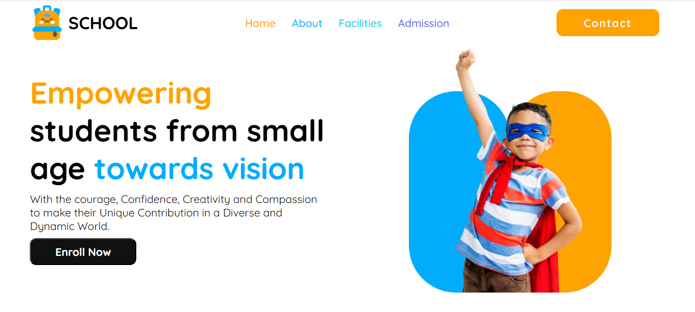

# My School Website

**Description:**  
Welcome to **My School Website**, a beginner-friendly, responsive website designed to showcase a school's basic information. This website is built using pure HTML and CSS to ensure ease of use and accessibility. It adapts beautifully to different screen sizes, making it perfect for viewing on both desktop and mobile devices.

---

## 🖥️ Tech Stack
- **Languages Used**: HTML, CSS
- **Design**: Fully responsive design

---

## 🌐 Live Link
You can view the live website by clicking on the link below:

[**My School Website**](https://abulhasan7bd.github.io/my-school/)

<button onclick="copyLink('https://abulhasan7bd.github.io/my-school/')">Copy Link</button>

---

## 📂 GitHub Repository
The source code for this project is hosted on GitHub. Feel free to explore, fork, or contribute!

[**My School Website GitHub Repository**](https://github.com/abulhasan7bd/my-school)

<button onclick="copyLink('https://github.com/abulhasan7bd/my-school')">Copy Link</button>

---

## 📱 Features
- **Responsive Design**: The layout adjusts to various screen sizes (desktop, tablet, mobile).
- **Simple Layout**: Clean and user-friendly interface that showcases the school’s sections.
- **Beginner-Friendly**: Built with a simple structure and pure HTML and CSS for easy understanding and modification.

---

## 📸 Screenshots


---

## 💻 Installation

1. Clone the repository using this command:
    ```bash
    git clone https://github.com/abulhasan7bd/my-school.git
    ```

2. Navigate to the project folder:
    ```bash
    cd my-school
    ```

3. Open `index.html` in your browser to view the website.

---

## 💬 Contributing

If you'd like to contribute to this project, feel free to fork the repository, create a branch, and submit a pull request. Contributions are welcome, whether it's fixing bugs or adding new features!

---

## 📝 License
This project is open-source and available under the [MIT License](LICENSE).

---

## 👨‍💻 Author
[Abul Hasan](https://github.com/abulhasan7bd)

---

### Thank you for visiting **My School Website**! Feel free to explore and provide feedback. ✨
